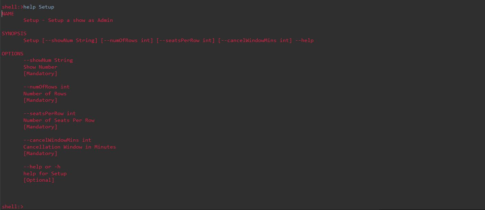

## A Show Booking CLI Application
#### About
This is a simple Java application built using Spring Boot and Spring Shell to provide an easy to use framework to create a command line application. GraalVM is also added as a dependency in maven so that we can compile this application into a native application using a command like `./mvnw -Pnative native:compile -DskipTests=true`

This application is built for 2 users, the Admin and the Buyer.

The Admin is given 2 commands.
1. Setup Command. Setup <Show Number> <Number of Rows> <Number of seats per row>
<Cancellation window in minutes>. Using this command, the Admin can setup a show for sale.
2. View Command. View <Show Number>. Using this command, the Admin can display the show number, ticket number, buyer phone number, and seat number in a neat, tabulated manner.,

The Buyer is given 3 commands.
1. Availability Command. Availability <Show Number>. This is to list all available seat numbers for a show. For example: [A1, F4]
2. Book Command. Book <Show Number> <Phone Number> <Comma separated list of seats>. This is to book a ticket. The application will then generate and print a unique ticket number.
3. Cancel Command. Cancel <Ticket Number> <Phone Number>. This allows the Buyer to cancel any tickets he has purchased. Do note that there is also programmed logic to prevent the Buyer from canceling an order after a configurable time has elapsed! Additionally, each phone number is allowed to make one transaction.

Additionally, there are 3 more commands available to everyone:
1. checkaccount command. With this command, you can check which account you are using.
2. setadmin command. This command will set the current user to the admin.
3. setbuyer command. This command will set the current user to the buyer.
4. help command. This command will print out all available commands, and their descriptions. The help command can also be used with another command to view more detailed information about the command. Information like what argument it takes, and what datatypes the arguments are expected to be. 

Here is a screenshot of what is printed by the help command:

Here is a screenshot of what is printed when the help command is used with another command:

Here is a screenshot of a demo of the entire application:

First, we use the checkaccount command to check which account we are using.
Then, we use the Setup command to create a show with Show Number 2, 4 rows, 4 seats per row, and a 2 minute cancellation window.
Then, we use the setbuyer command to change accounts to the buyer account.
Then, we use the Availability command to check for available shows.
We see that Show Number 2 is available, so we use the Book command to purchase some tickets.
Then, we decide to cancel ticket number 0 for seat D1 using the Cancel command.
As it is within the cancellation window of 2 minutes, it succeeds.
Then, we go back to the admin account and use the View command to check the ticket sales in a neat table.
Then, we go back to the buyer account to cancel another ticket, but as 2 minutes has passed, we cannot.